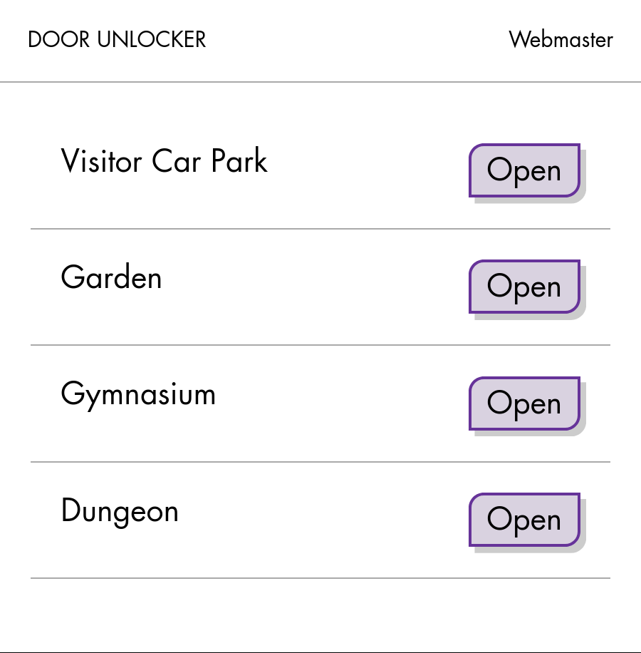

# Unlockr

Simple web-based device control with flexible authentication.

## Features

- Standalone Go HTTP server
- OAuth or SQL query authentication
- Ewelink devices currently supported
- Generic interfaces for adding new device APIs
- Lightweight web interface, installable as PWA

## Caveats

This is not a "batteries included" tool, and has many limitations. Nor is it
intended to replace or compete with things like [Home Assistant](https://www.home-assistant.io/).

I wrote it to use in a very specific scenario, and my architectural choices
are based purely on self-learning and interest, not best practices.

For example, I wanted an excuse to learn [Lit](https://lit.dev/) and
Web Components, but I'm still a relative frontend newbie. For example, there
is no integration or unit testing for the frontend.

If you want a polished web-based controller for your home devices that doesn't
require customisation, this might not be the tool for you.

## Future ideas

- Support more devices and APIs, especially:
  - HTTP REST
  - Local GPIO
- Support more device actions, not just a power-on
- Abstract the user-facing API in terms of "dashboards" and "actions", which
  are mapped only to device actions on the backend
- Support more OAuth APIs
- Improve config parsing consistency
  - e.g. device configs are typed by parent key, while OAuth profiles are typed with a "type" field
- Write a *lot* more unit tests

## Screenshot

